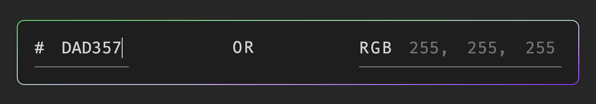
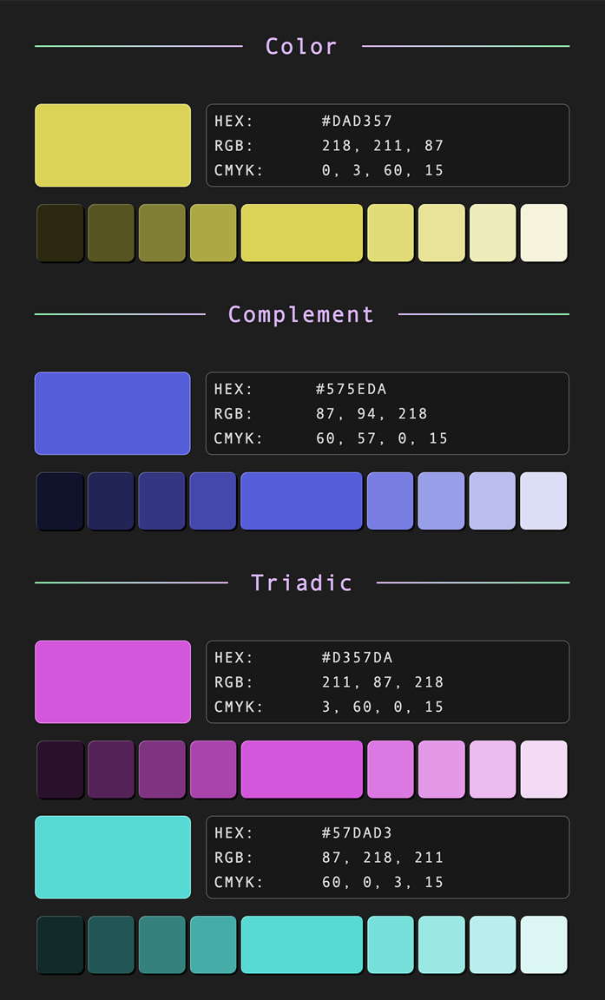
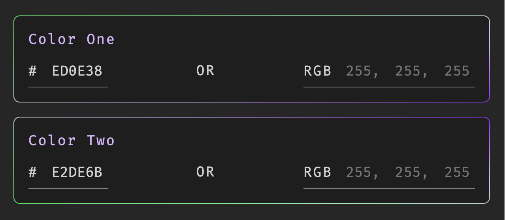
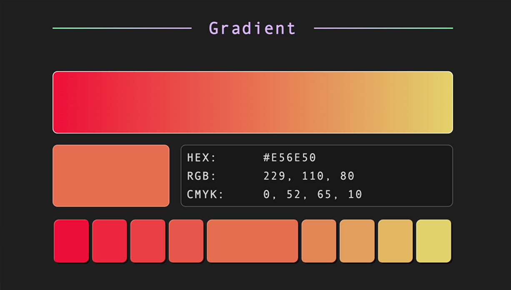

# BLEND.js
Search a color code. Retrieve hexadecimal, RGB, and CMYK information, and 
display their corresponding palettes.

---

## Search Tab
Enter one color code with either of the following formats:

- 3 or 6 character hexadecimal value (charactera 0-9 and A-F).
- Individual red, green, and blue values (integers 0-255).

#### Example
> `DAD`  
> `DAD357`  
> `255`, `255`, `255`

## Blend Tab
Enter two color codes with either of the following formats:

- 3 or 6 character hexadecimal value (charactera 0-9 and A-F).
- Individual red, green, and blue values (integers 0-255).

#### Example
> `DAD` and `DAD357`  
> `255`, `255`, `255` and `FFFEEE`  
> `110`, `120`, `130` and `255`, `255`, `255`  

## Random Tab
This tab can be used to generate either a single random color with a corresponding 
color palette, or two random blended colors.